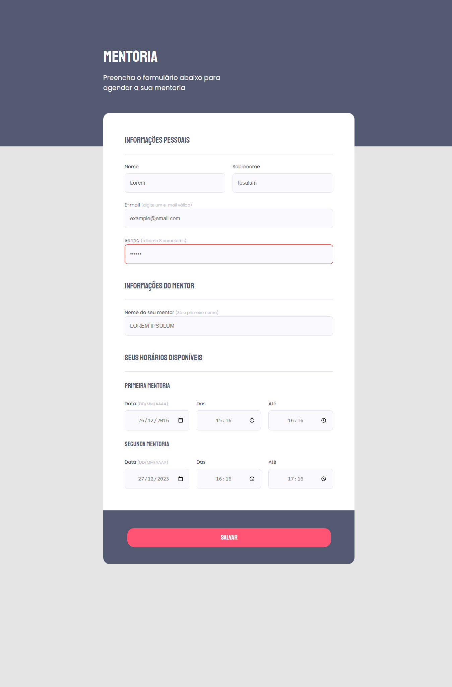

<strong><h1 align="center">Estudo de Formulário</h1></strong>

  

## 🚀 Tecnologias

Esse projeto foi desenvolvido com as seguintes tecnologias:

- HTML
- CSS

## 🎨 Acesse o layout:

- [Figma do Projeto](https://www.figma.com/file/5Siry8SNfezqJTgu8gg9Gq/Stage-03---Formul%C3%A1rio-intermedi%C3%A1rio-(Copy)?type=design&node-id=3%3A4&t=0rMZe2a2xe1bJJAL-1)

## 🌍 Acesse o site:

- [Clique aqui para visualizar](https://codepen.io/Peluzio/pen/JjmpPPN)

---

by João Victor Peluzio 🚀

