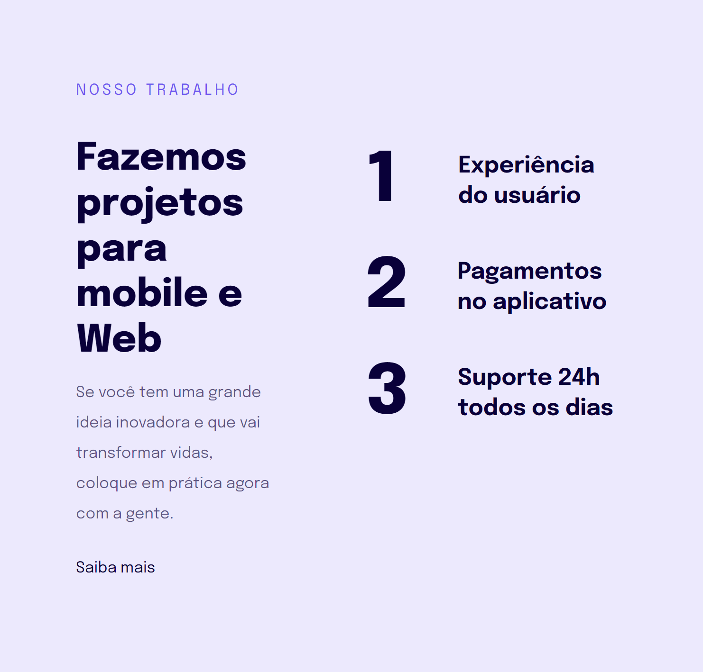
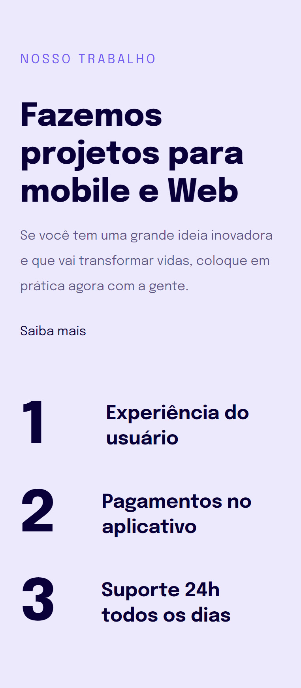

<strong><h1 align="center">Estudo de Responsividade</h1></strong>

  
  

## 🚀 Tecnologias

Esse projeto foi desenvolvido com as seguintes tecnologias:

- HTML
- CSS

## 🎨 Acesse o layout:

- [Figma do Projeto](https://www.figma.com/file/s0FMJAGzMydAJcoROmVFDJ/Explorer-Stage-03-Projeto-02-(Copy)?type=design&node-id=203%3A1745&t=DGU3PPLbQ8nJyDd9-1)

## 🌍 Acesse o site:

- [Clique aqui para visualizar](https://codepen.io/Peluzio/pen/WNazrjz)

---

by João Victor Peluzio 🚀