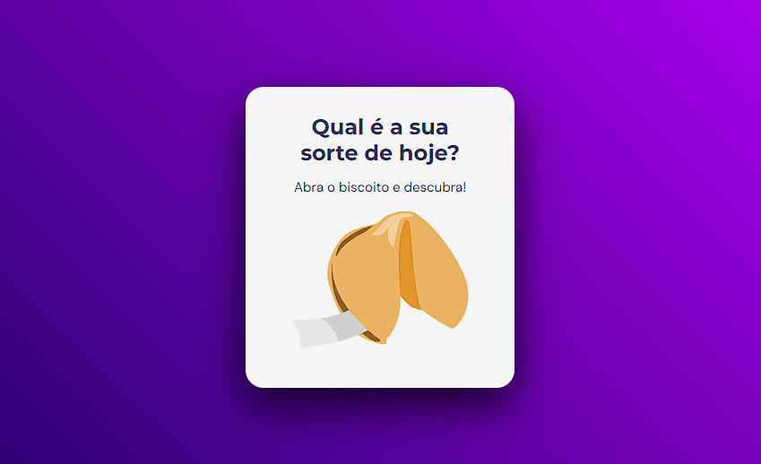
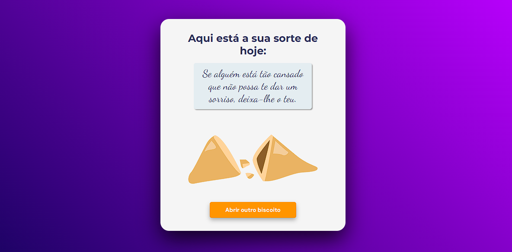

  
  

  
  

## 🖥️ Projeto

O projeto é um estudo de manipulação do DOM. 

## 🚀 Tecnologia

Esse projeto foi desennvolvido com as seguintes tecnologias:

- HTML
- CSS
- Javascript
- GIT e GITHUB

## 🏷️ Layout

Você pode visuzalizar o layout do projeto através 
[Desse link](https://www.figma.com/community/file/1182751789348533739/biscoito-da-sorte).
É necessário ter uma conta no [Figma](https://www.figma.com)